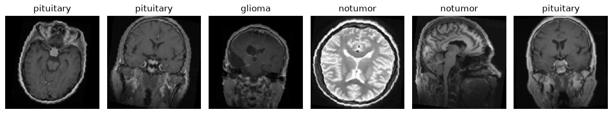
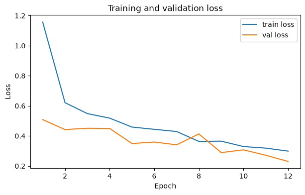
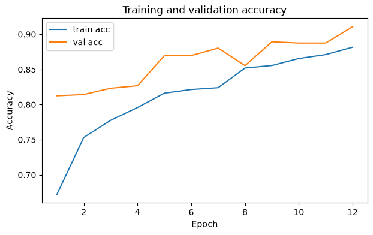
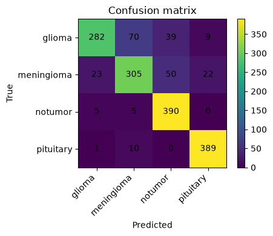

# Brain Tumor MRI Classification with a CNN (PyTorch)

A convolutional neural network built from scratch in PyTorch that classifies brain MRI slices into four classes: **glioma, meningioma, pituitary tumor, or no tumor**. Covers the full image-classification workflow: loading an image dataset from the Hugging Face Hub, label checks, transforms and augmentation, a custom CNN, a training loop with best-checkpoint selection, and evaluation on a held-out test set.

## Overview

| | |
|---|---|
| **Dataset** | [Brain Tumor MRI Dataset](https://huggingface.co/datasets/BJyotibrat/Masoud-Nickparvar-Brain-Tumor-MRI-Dataset) (Masoud Nickparvar, CC BY 4.0). 7,200 images, perfectly balanced (1,800 per class) |
| **Splits** | 5,040 train / 560 validation (from the official *Training* folder) · 1,600 test (the official *Testing* folder, never seen during training) |
| **Input** | RGB images resized to 128 × 128, normalized |
| **Model** | 3 conv blocks (Conv → BatchNorm → ReLU → MaxPool; 32 → 64 → 128 filters) + MLP head (256 units, dropout 0.3) |
| **Training** | Adam (lr 1e-3), cross-entropy, batch 16, 12 epochs, best-validation checkpoint restored |
| **Tools** | PyTorch, torchvision, Hugging Face `datasets`, scikit-learn, matplotlib |

<p align="center">
  
</p>

## Results (official test set, n = 1,600)

| Metric | Score |
|---|---|
| Accuracy | **85.4%** (vs. 25% chance) |
| Macro F1 | 0.850 |
| Best validation accuracy | 91.1% |

| Class | Precision | Recall | F1 |
|---|---|---|---|
| Glioma | 0.907 | 0.705 | 0.793 |
| Meningioma | 0.782 | 0.762 | 0.772 |
| No tumor | 0.814 | 0.975 | 0.887 |
| Pituitary | 0.926 | 0.973 | 0.949 |

<p align="center">
  
  
  
</p>

Pituitary tumors and tumor-free scans are recognized almost perfectly. Most errors are gliomas predicted as meningiomas or as "no tumor" (the clinically costly direction), which would be the first thing to address with a larger input resolution, longer training, or a pretrained backbone (transfer learning). Validation loss was still falling at epoch 12, so more epochs would likely help.

## Labeling fix

An earlier version used the `mars-hm/tumor_cnn` dataset and inferred each label from the image's parent folder. In that dataset every image sits in a single `train/` folder and every scan is tumor-positive (its annotation files contain segmentation polygons, not classes), so all images received the same label and the model "achieved" a meaningless 100% accuracy. This version:

- switches to a dataset with real class labels (glioma / meningioma / pituitary / no tumor),
- reads labels from the dataset's `ClassLabel` column and **asserts that more than one class is present**, so a collapse like this fails loudly,
- keeps the dataset's official Testing images as an untouched test set.

## Run it

```bash
pip install -r requirements.txt
jupyter notebook brain_mri_cnn.ipynb
```

The first run downloads ~7,200 images (~170 MB) from the Hugging Face Hub. Training on a CPU is slow (several minutes per epoch); a GPU is used automatically if available.
